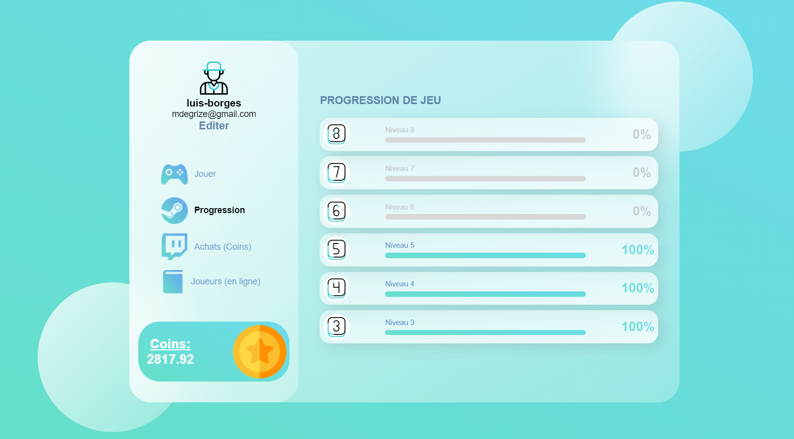
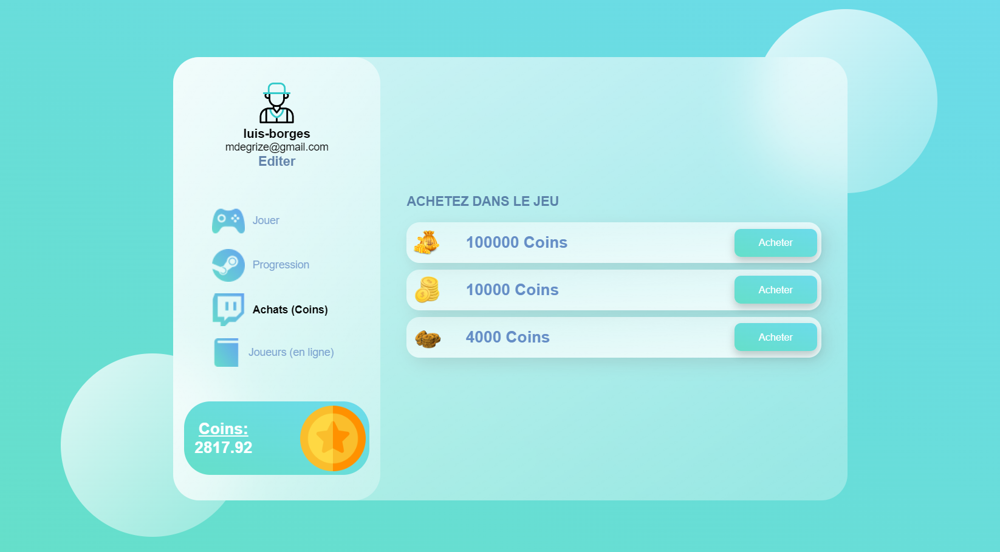
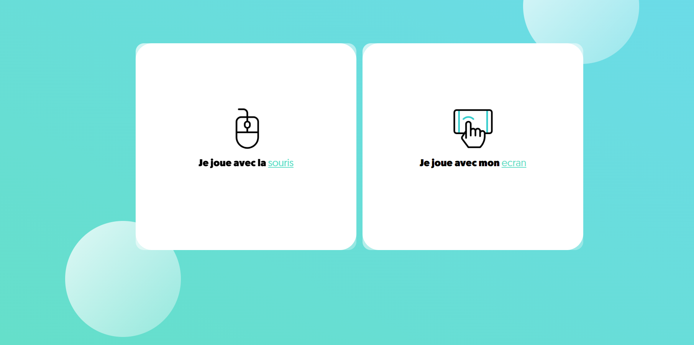

# 💼 PHP-Hanoi-ing2
Le projet php de la tour d'hanoi proposé par notre prof M. Konan KAN 😎

## [Contribuez au projet sur Github](https://github.com/degrize/PHP-Hanoi-ing2)
### 💼 Tour d'Hanoï 

##### 👌 Fonctionnalités

- L'utilisateur pourra utiliser la sourie de son ordinateur pour déplacer les disques et avoir la possibilité d'utiliser son doigt si celui ci possède un écran tactile
- Rendre le jeu disponible sur un format adapter Web ou Mobile
- Implémenter le système des historiques
- Ajouter la fonctionnalité d'authentification
- Envoyer les identifications de connexions par e-mail lorsque celui-ci a oublié son mot de passe
- Envoyer un mail au joueur lorsqu'un autre joueur à dépasser son score (meilleur score)
- Multiplayer : possibilité de jouer à plusieurs
💙 










# NOTRE MODELISATION


# NOS REQUETES SQL
```
RequeteSQL.sql
```
